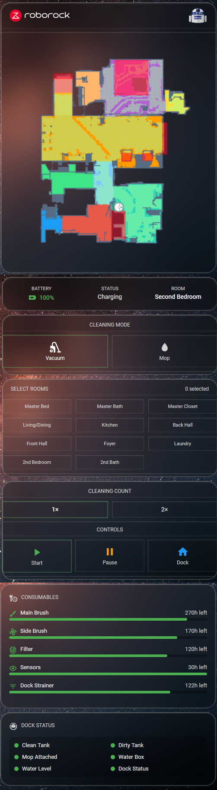

# Roborock Vacuum Dashboard for Home Assistant

A comprehensive Roborock robot vacuum control dashboard built with custom Lovelace cards. Features room-by-room cleaning control, mode switching, live map display, consumables tracking, and dock status monitoring — all in a clean, dark-themed UI.



## Features

- **Status Bar** — Battery level (color-coded), vacuum status, current room
- **Mode Toggle** — Switch between Vacuum and Mop modes with one tap
- **Mop Options** — Water flow and route selection (only visible in Mop mode)
- **Room Selection** — Toggle grid for selecting specific rooms to clean
- **Cleaning Controls** — Start (with confirmation), Pause, and Dock buttons
- **Repeat Count** — Clean selected rooms 1× or 2×
- **Live Map** — Display-only map from the native Roborock integration
- **Cleaning Stats** — Last clean info, area, duration, progress bar, lifetime totals
- **Consumables** — Visual progress bars for brushes, filter, sensors, dock strainer
- **Dock Status** — Tank levels, mop attachment, water status, drying timer, error alerts

## Prerequisites

### HACS Frontend Plugins (Required)
- [button-card](https://github.com/custom-cards/button-card)
- [stack-in-card](https://github.com/custom-cards/stack-in-card)
- [card-mod](https://github.com/thomasloven/lovelace-card-mod)

### Home Assistant Integrations
- [Roborock](https://www.home-assistant.io/integrations/roborock/) (core integration)

### Confirmed Compatible Models
- Roborock QRevo S

Other Roborock models with the core HA integration should work — you'll just need to update entity names and room IDs.

## Installation

### Step 1: Create Input Booleans

Copy the contents of `config/input_booleans.yaml` into your input boolean configuration.

If you use split YAML with `!include_dir_merge_named`:
```yaml
# configuration.yaml
input_boolean: !include_dir_merge_named input_booleans/
```
Create the file at `/config/input_booleans/roborock_vacuum.yaml`.

If you define input booleans inline in `configuration.yaml`, merge the contents under your existing `input_boolean:` key.

### Step 2: Create Input Number

Copy the contents of `config/input_numbers.yaml` into your input number configuration.

Same options apply — split YAML or inline in `configuration.yaml`.

### Step 3: Add Scripts

Copy the three scripts from `config/scripts.yaml` into your `/config/scripts.yaml`.

**Important:** You must customize the scripts for your setup:
- Replace `vacuum.YOUR_VACUUM` with your vacuum entity ID
- Replace `select.YOUR_VACUUM_mop_intensity` and `select.YOUR_VACUUM_mop_mode` with your vacuum's select entities
- Update room IDs in `start_vacuum_clean` (see "Finding Your Room IDs" below)
- Adjust `fan_speed` values if your model supports different options

### Step 4: Copy SVG Icons

Copy the `www/icons/` folder to your Home Assistant `/config/www/icons/` directory. The dashboard header references:
- `/local/icons/roborock-logo-white.svg`
- `/local/icons/r2d2.svg`

> **Note:** The R2-D2 icon is a Star Wars easter egg. Feel free to swap it for any SVG you like, or remove the header entirely.

### Step 5: Add the Dashboard

1. In Home Assistant, go to your dashboard
2. Create a new subview (or view)
3. Open the Raw Configuration Editor
4. Paste the contents of `dashboard/r2_vacuum_subview.yaml`
5. **Find and replace** all placeholder entity IDs with your actual entities (see "Entity Customization" below)

### Step 6: Add Recorder Excludes (Optional but Recommended)

The input booleans and input number are UI state toggles — no need to record their history. Add to your `recorder:` configuration:

```yaml
recorder:
  exclude:
    entities:
      - input_boolean.vacuum_mop_mode
      - input_boolean.vacuum_room_1
      - input_boolean.vacuum_room_2
      # ... all room toggles
      - input_number.vacuum_clean_repeat
```

## Entity Customization

The dashboard YAML uses placeholder entity IDs that you **must** replace with your actual entities. Search and replace these:

| Placeholder | Your Entity | Description |
|---|---|---|
| `vacuum.YOUR_VACUUM` | `vacuum.roborock_s7` | Your vacuum entity |
| `sensor.YOUR_VACUUM_battery` | `sensor.roborock_s7_battery` | Battery level |
| `binary_sensor.YOUR_VACUUM_charging` | `binary_sensor.roborock_s7_charging` | Charging state |
| `sensor.YOUR_VACUUM_status` | `sensor.roborock_s7_status` | Vacuum status |
| `sensor.YOUR_VACUUM_current_room` | `sensor.roborock_s7_current_room` | Current room |
| `sensor.YOUR_VACUUM_vacuum_error` | `sensor.roborock_s7_vacuum_error` | Error state |
| `image.YOUR_VACUUM_map` | `image.roborock_s7_upstairs` | Map image entity |
| `sensor.YOUR_VACUUM_cleaning_area` | `sensor.roborock_s7_cleaning_area` | Current clean area |
| `sensor.YOUR_VACUUM_cleaning_time` | `sensor.roborock_s7_cleaning_time` | Current clean time |
| `sensor.YOUR_VACUUM_cleaning_progress` | `sensor.roborock_s7_cleaning_progress` | Clean progress % |
| `sensor.YOUR_VACUUM_last_clean_begin` | `sensor.roborock_s7_last_clean_begin` | Last clean start |
| `sensor.YOUR_VACUUM_total_cleaning_area` | `sensor.roborock_s7_total_cleaning_area` | Lifetime area |
| `sensor.YOUR_VACUUM_total_cleaning_count` | `sensor.roborock_s7_total_cleaning_count` | Lifetime cleans |
| `sensor.YOUR_VACUUM_total_cleaning_time` | `sensor.roborock_s7_total_cleaning_time` | Lifetime time |
| `sensor.YOUR_VACUUM_main_brush_time_left` | `sensor.roborock_s7_main_brush_time_left` | Main brush life |
| `sensor.YOUR_VACUUM_side_brush_time_left` | `sensor.roborock_s7_side_brush_time_left` | Side brush life |
| `sensor.YOUR_VACUUM_filter_time_left` | `sensor.roborock_s7_filter_time_left` | Filter life |
| `sensor.YOUR_VACUUM_sensor_time_left` | `sensor.roborock_s7_sensor_time_left` | Sensor life |
| `sensor.YOUR_VACUUM_dock_strainer_time_left` | `sensor.roborock_s7_dock_strainer_time_left` | Dock strainer |
| `binary_sensor.YOUR_VACUUM_dock_clean_water_box` | ... | Clean tank status |
| `binary_sensor.YOUR_VACUUM_dock_dirty_water_box` | ... | Dirty tank status |
| `binary_sensor.YOUR_VACUUM_dock_mop_drying` | ... | Mop drying state |
| `sensor.YOUR_VACUUM_dock_mop_drying_remaining_time` | ... | Drying time left |
| `sensor.YOUR_VACUUM_dock_dock_error` | ... | Dock error state |
| `binary_sensor.YOUR_VACUUM_mop_attached` | ... | Mop attached |
| `binary_sensor.YOUR_VACUUM_water_box_attached` | ... | Water box state |
| `binary_sensor.YOUR_VACUUM_water_shortage` | ... | Water level |
| `select.YOUR_VACUUM_mop_intensity` | ... | Mop water flow |
| `select.YOUR_VACUUM_mop_mode` | ... | Mop route mode |

> **Tip:** In Home Assistant, go to Developer Tools → States, filter by your vacuum name, and you'll see all available entities.

## Finding Your Room IDs

Room IDs are required for the `start_vacuum_clean` script. To find yours:

1. Go to **Developer Tools → Actions**
2. Select `vacuum.send_command`
3. Target your vacuum entity
4. Use command `get_room_mapping` (or check your Roborock app)
5. Update the room ID mappings in `config/scripts.yaml`

Common room ID format: integer values (e.g., 16, 17, 18...).

## Map Display Tuning

The map card uses CSS transforms to crop and center the map image, since the raw Roborock map often has excessive transparent padding. The current values are:

```yaml
transform: scale(1.3) translateY(11%);
```

You'll almost certainly need to adjust these for your floor plan:
- `scale()` — zoom level (1.0 = no zoom, 2.0 = 2× zoom)
- `translateY()` — vertical position (negative = up, positive = down)
- You can also add `translateX()` for horizontal adjustment

## Customization Notes

### Fan Speed Options
The dashboard's vacuum mode script uses `max_plus` fan speed. Your model may support different values. Check Developer Tools → States → your vacuum entity → `fan_speed_list` attribute.

### Mop Mode
There is no true "mop only" mode on Roborock vacuums — the fan always runs. "Mop mode" in this dashboard sets a lower suction level (`turbo`) with mopping enabled. Adjust to your preference in the scripts.

### Consumable Max Hours
The consumables card uses these defaults for progress bar calculations:
- Main Brush: 300 hours
- Side Brush: 200 hours
- Filter: 150 hours
- Sensors: 30 hours
- Dock Strainer: 150 hours

Adjust these in the dashboard YAML if your model differs.

### Drying Time
The dock's mop drying remaining time sensor returns values in **seconds**. The dashboard converts to minutes for display. If your sensor uses different units, adjust the conversion in the dock status card.

### Theme
This dashboard was designed for the [visionOS Liquid Glass](https://github.com/nicoritschel/visionOS-Liquid-Glass-Theme) theme with a dark background. The styling uses:
- `rgba(0,0,0,0.2)` for inactive card backgrounds
- `rgba(76,175,80,0.4)` (green) for vacuum mode / selected rooms
- `rgba(66,165,245,0.4)` (blue) for mop mode / options
- `var(--secondary-text-color)` and `var(--primary-text-color)` for text

These should work on most dark themes. Light themes may need color adjustments.

## File Structure

```
r2-vacuum-dashboard/
├── README.md
├── dashboard/
│   └── r2_vacuum_subview.yaml    # Complete subview card YAML
├── config/
│   ├── input_booleans.yaml       # Room selection + mode toggles
│   ├── input_numbers.yaml        # Cleaning repeat count
│   └── scripts.yaml              # Vacuum/mop mode + room clean scripts
├── www/
│   └── icons/
│       ├── roborock-logo-white.svg
│       └── r2d2.svg
└── screenshots/
    └── (add your own!)
```

## Credits

Built with:
- [custom:button-card](https://github.com/custom-cards/button-card)
- [custom:stack-in-card](https://github.com/custom-cards/stack-in-card)
- [card-mod](https://github.com/thomasloven/lovelace-card-mod)
- [Roborock Core Integration](https://www.home-assistant.io/integrations/roborock/)
- [Thanks to Daniel Torobekov for my dashboard background](https://www.pexels.com/photo/low-angle-shot-of-a-starry-night-sky-10257142/)

## License

MIT — do whatever you want with it.
